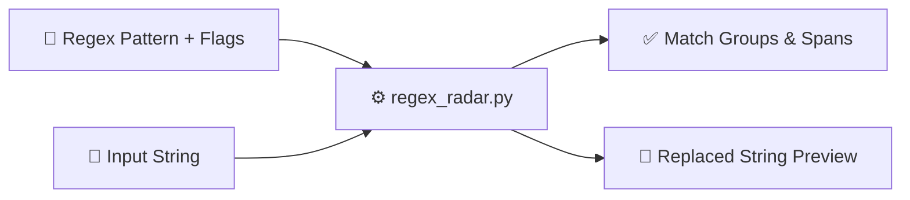

<div align="center">

# 🚀 regex-radar

### *Visual regex pattern tester, group matcher & cheat-sheet CLI.*

[](https://github.com/TauqeerMustafa/regex-radar/actions)
[](LICENSE)
[](https://www.python.org/)
[](regex_radar.py)
[](CONTRIBUTING.md)

<br/>

<p align="center">
  <a href="#-why-use-regex-radar">Why regex-radar?</a> •
  <a href="#-instant-preview">Demo</a> •
  <a href="#-quick-start">Quick Start</a> •
  <a href="#-architecture">Architecture</a> •
  <a href="#-cli-reference">CLI Reference</a> •
  <a href="#-contributing">Contributing</a> •
  <a href="#-license">License</a>
</p>

</div>

---

## 💡 Why Use `regex-radar`?

- **Visual Group Extraction**: Clearly breaks down capture groups and index spans.
- **Instant Substitution**: Test `--replace` strings directly in the terminal.
- **Built-in Cheat Sheet**: Access common regex tokens and rules without opening a browser.

---

## 🎬 Instant Preview

```bash
$ python regex_radar.py --pattern "([a-zA-Z0-9_.+-]+)@([a-zA-Z0-9-]+\.[a-zA-Z0-9-.]+)" --text "Contact info@example.com for help."
============================================================
🎯 REGEX MATCHING RESULTS
============================================================
Pattern : /([a-zA-Z0-9_.+-]+)@([a-zA-Z0-9-]+\.[a-zA-Z0-9-.]+)/
Input   : "Contact info@example.com for help."
✅ Found 1 match(es):
  [1] 'info@example.com' at index (8, 24)
      Groups: ('info', 'example.com')
============================================================
```

---

## ⚡ Quick Start

```bash
# 1. Clone the repository
git clone https://github.com/TauqeerMustafa/regex-radar.git
cd regex-radar

# 2. Run CLI tool immediately (No pip install required)
python regex_radar.py --help
```

---

## 🏛️ Architecture & Workflow



---

## 💻 CLI Reference

| Command | Description |
| :--- | :--- |
| `python regex_radar.py --help` | Display full help menu and flag options |
| `python regex_radar.py` | Run default execution mode |

---

## 🤝 Contributing

Contributions, feature suggestions, and pull requests are warmly welcomed!
- Read our [Contributing Guidelines](CONTRIBUTING.md).
- Follow our [Code of Conduct](CODE_OF_CONDUCT.md).

---

## 📄 License

Distributed under the **MIT License**. See [`LICENSE`](LICENSE) for details.

<div align="center">
  <sub>Crafted with ❤️ for the open-source community by <a href="https://github.com/TauqeerMustafa">Tauqeer Mustafa</a>.</sub>
</div>
